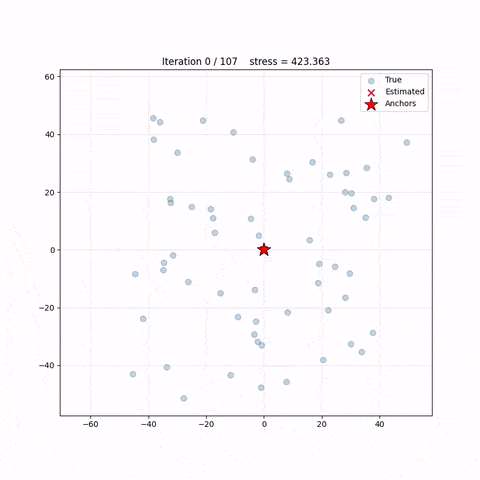

# Self‑Localizing Sensor Network (SLSN)

<p align="center">
  
  <br>
  <em>Convergence of the estimated positions (red) toward ground truth (blue).</em>
</p>

You can get the relative geometry of a collection of sensors (electronic devices) using only node-to‑node distance measurements. This project includes:

- **Anchor selection** – picks three well‑spaced nodes with direct links.
- **Canonical placement** – fixes anchors in a reference frame.
- **Iterative trilateration** – localises nodes with ≥3 known neighbours.
- **Stress minimisation** – refines all free nodes via gradient descent on the mean squared edge‑length error.

When done, it provides visualizations of the whole process.

---

## Installation

Clone the repository and install the package:

```bash
git clone https://github.com/yourusername/self-localizing-sensor-network.git
cd slsn
pip install -e .
```

For running tests, install the optional test dependencies:
```bash
pip install -e .[test]
```
